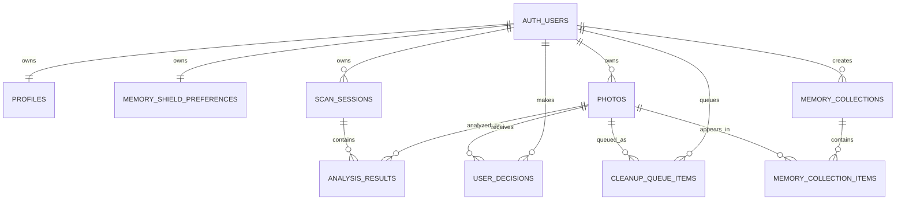

# PhotoGuard AI

PhotoGuard AI is a mobile-first memory protection assistant for photo cleanup. It helps users review their gallery, identify safe cleanup opportunities, and protect meaningful memories before anything is suggested for removal.

## Product Overview

PhotoGuard AI is designed around a simple promise: clean your gallery without risking the photos that matter. Instead of behaving like a generic storage cleaner, the app treats memory protection as the first step. Users can sign in, personalize their Smart Memory Shield, review AI-style cleanup suggestions, and keep control before any removal decision feels final.

## Problem Solved

Photo galleries become crowded with duplicates, screenshots, low-quality shots, and forgotten clutter. Existing cleanup tools often focus on storage recovery first, which can make users nervous about losing emotional or important photos. PhotoGuard AI solves this by prioritizing safety, review, and user preference before cleanup.

## Target Audience

- Mobile users with large, cluttered photo libraries.
- Families and travelers who want to preserve meaningful memories.
- Users who are cautious about automated deletion.
- People who want guided cleanup rather than aggressive storage tools.

## Competitors And Differentiation

| Product | Strength | PhotoGuard AI Difference |
| --- | --- | --- |
| Apple Photos | Strong memory organization | PhotoGuard focuses specifically on safe cleanup decisions. |
| Google Photos | Powerful search and cloud organization | PhotoGuard adds explicit protection preferences before cleanup. |
| Gemini Photos / cleanup apps | Storage cleanup and duplicate detection | PhotoGuard is calmer, review-first, and memory-preservation-first. |
| Phone storage tools | Simple space recovery | PhotoGuard explains risk and keeps users in control. |

## Main User Flow

1. User signs up or logs in.
2. Protected routes load only after a valid Supabase session exists.
3. User lands on the Dashboard.
4. User customizes Smart Memory Shield categories.
5. User starts a smart scan from the Dashboard.
6. User selects photos from the library demo flow.
7. User reviews AI-style analysis results.
8. User reviews suggested removals.
9. Approving removal moves an item into a local cleanup queue with Undo.
10. User can manage accessibility and app preferences in Settings.

## Links

- Live Vercel URL: `https://your-vercel-url.vercel.app`
- GitHub Repository: `https://github.com/your-username/photoguard-ai`

## Tech Stack

- Vite
- React 18
- React Router
- JavaScript
- CSS Modules
- Mantine v7
- lucide-react
- framer-motion
- Supabase Auth
- Supabase Postgres
- Supabase Storage schema
- Vercel deployment target

## Supabase Auth

PhotoGuard AI uses Supabase Authentication for user accounts.

- Email/password signup and login are supported.
- Supabase session persistence is enabled through `persistSession`.
- Auth state is managed by `src/hooks/useAuth.jsx`.
- Protected routes are guarded in `src/App.jsx`.
- Logged-out users are redirected to `/login`.
- Logged-in users can access Dashboard, Library, Analysis, Review, Settings, Memories, Shield, and Insights pages.
- Logout is available from the app account/settings flow.

## Supabase Database Tables

The database schema is defined in `supabase/schema.sql`.

| Table | Purpose |
| --- | --- |
| `profiles` | App-facing user profile data linked to `auth.users`. |
| `memory_shield_preferences` | Stores each user's protected memory categories. |
| `photos` | Intended table for uploaded photo metadata. |
| `scan_sessions` | Tracks photo scan sessions. |
| `analysis_results` | Stores AI analysis results for photos in a scan. |
| `user_decisions` | Stores keep/remove/protected user decisions. |
| `cleanup_queue_items` | Stores photos queued for cleanup. |
| `memory_collections` | Stores memory archive groupings. |
| `memory_collection_items` | Links photos to memory collections. |

## RLS Explanation

Row Level Security is enabled on all app-owned public tables. Policies are written so authenticated users can only access rows that belong to their own Supabase user ID.

High-level policy model:

- `profiles`: users can select, insert, and update only their own profile.
- `memory_shield_preferences`: users can manage only their own preferences.
- `photos`: users can manage only their own photo metadata.
- `scan_sessions`: users can manage only their own scan sessions.
- `analysis_results`: access is allowed only through scan sessions owned by the user.
- `user_decisions`: users can manage only their own decisions.
- `cleanup_queue_items`: users can manage only their own cleanup queue.
- `memory_collections`: users can manage only their own memory collections.
- `memory_collection_items`: access is allowed only through collections owned by the user.
- Supabase Storage `photos` bucket: users can access files only inside their own user ID folder.

## ERD Summary



## External Services And Integrations

| Service | Usage | Required For Submission |
| --- | --- | --- |
| Supabase Auth | Login, signup, logout, session persistence. | Yes |
| Supabase Postgres | Memory Shield preferences and ERD-ready product schema. | Yes |
| Supabase Storage | Schema-ready private photo bucket. | Recommended |
| Vercel | Production hosting target. | Yes |
| Browser localStorage | Accessibility/settings preferences only. | No backend requirement |

## Environment Variables

Create `.env.local` for local development and configure the same variables in Vercel.

```bash
VITE_SUPABASE_URL=your_supabase_project_url
VITE_SUPABASE_ANON_KEY=your_supabase_anon_or_publishable_key
```

See `.env.example` for the template.

## Local Setup

```bash
npm install
npm run dev
```

Open:

```text
http://localhost:5173
```

Production build:

```bash
npm run build
```

Preview production build locally:

```bash
npm run preview
```

## Supabase Setup

1. Create a Supabase project.
2. Copy the project URL and anon/publishable key into `.env.local`.
3. Open the Supabase SQL editor.
4. Run `supabase/schema.sql`.
5. Enable email/password authentication in Supabase Auth.
6. Add the same environment variables to Vercel before deploying.

The schema creates app tables, indexes, triggers, RLS policies, and a private `photos` storage bucket.

## Routes

| Route | Page |
| --- | --- |
| `/login` | Login |
| `/signup` | Sign up |
| `/dashboard` | Home dashboard |
| `/select-photos` | Photo library selection |
| `/analysis` | AI analysis results |
| `/review` | Safe cleanup review |
| `/settings` | Settings and accessibility |
| `/memories` | Memory timeline and archive |
| `/shield` | Smart Memory Shield |
| `/insights` | Memory and cleanup insights |

## Demo Data Note

This project uses a hybrid implementation for final presentation:

Supabase-backed:

- Authentication.
- Session persistence.
- Protected routes.
- Smart Memory Shield preferences.
- Schema-ready tables for photos, scan sessions, analysis results, decisions, cleanup queue, and memory collections.

Demo/local data:

- Photo library thumbnails and sample photo metadata.
- AI analysis result examples.
- Dashboard stat numbers.
- Review photo examples.
- Memory timeline examples.
- Insights and storage recovery examples.
- Smart Undo Queue state on Review is local React state for demo safety behavior.
- Accessibility and notification settings are stored locally in the browser.

The demo data is intentional for presentation because the project focuses on the product flow, safety model, and Supabase-ready architecture without requiring real photo uploads.

## Vercel Deployment Readiness

This project includes `vercel.json` with an SPA fallback so direct visits to routes like `/dashboard`, `/settings`, or `/review` serve `index.html`.

Before deploying:

1. Add `VITE_SUPABASE_URL` in Vercel.
2. Add `VITE_SUPABASE_ANON_KEY` in Vercel.
3. Run the Supabase schema in the production Supabase project.
4. Confirm Supabase Auth email/password is enabled.
5. Run `npm run build` locally.

## Known Limitations And Future Work

- Real photo upload and cloud storage flow is schema-ready but not fully wired into the UI.
- AI analysis currently uses demo results rather than a live AI model.
- Review decisions and cleanup queue have database tables but the visible review flow is currently local/demo.
- Dashboard statistics are demo values.
- Memory timeline and insights pages use demo data.
- Future work should connect photo upload, scan sessions, analysis results, user decisions, and cleanup queue to Supabase end to end.
- Future work should add production analytics, error monitoring, and more complete accessibility testing.
